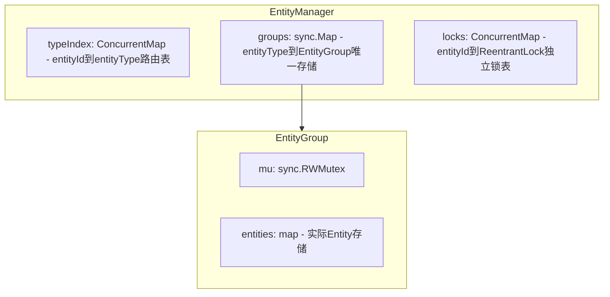
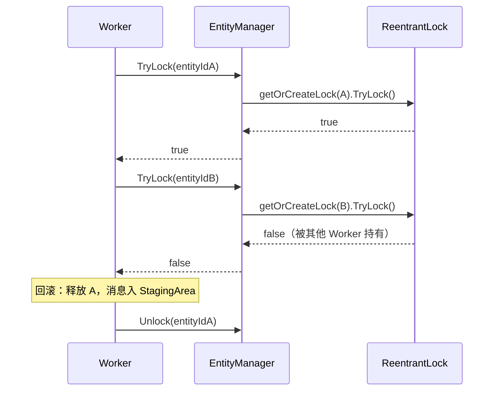

# EntityManager 线程安全管理器设计方案

## 职责边界

EntityManager是纯数据结构层（内存数据和可重入锁管理）。

## 1. 需求

1. **O(1) ID 查找**：通过唯一 EntityId (`int64`) 快速获取 Entity
2. **按类型加锁遍历**：通过 EntityType 快速遍历所有同类型 Entity，遍历期间组级读锁保护，阻止结构变更
3. **Per-Entity TryLock**：以 EntityId 为粒度进行非阻塞加锁（TryLock），支持先锁后加载

---

## 2. 问题分析：为什么不用双存储

### 2.1 双存储方案（已否决）

最直观的做法是维护两个独立索引：

- `all`: `ConcurrentMap[int64, IEntity]` — 全局 O(1) 查找
- `groups`: `map[EntityType]*EntityGroup` — 按类型遍历

**致命问题**：`Add/Remove` 需要同时写两个数据结构，无法保证原子性。无论先写哪个，都存在时间窗口导致数据不一致：

```
先写 all，后写 groups:
  Thread A: all.Set(id, entity) ──── [窗口] ──── group.Add(entity)
  Thread B:         ↑ Get(id) ✅ 成功              RangeByType ❌ 遗漏

先写 groups，后写 all:
  Thread A: group.Add(entity) ──── [窗口] ──── all.Set(id, entity)
  Thread B:         ↑ RangeByType ✅ 发现          Get(id) ❌ 找不到
```

### 2.2 方案选型

| 方案 | 核心思路 | 优点 | 缺点 |
|:-----|:---------|:-----|:-----|
| A. Group RWMutex 覆盖双写 | Add/Remove 在 group.mu.Lock 内同时写 all 和 group | Get 最快（单次 cmap 查找） | Get 与 RangeByType 之间仍有微弱不一致 |
| **B. 单一存储 + 路由索引（采用）** | Entity 只存 group，`all` 退化为 typeIndex 路由表 | 从根源消除双写问题 | Get 变为两次查找（仍为 O(1)） |
| C. 接受短暂不一致 | 约定写入顺序，容忍纳秒级窗口 | 最简单，性能最高 | 存在不一致窗口 |

**最终选择方案 B**：Entity 只有一份存储，从根源消除双写不一致问题。Get 的额外开销（约多 20-30ns）对万级 QPS 游戏服务器可忽略。

---

## 3. 整体架构



三个组件各司其职：

- **typeIndex** (`cmap.ConcurrentMap[int64, mme.EntityType]`)：ID → Type 路由表，**不存 Entity 本身**，仅辅助 `Get` 定位到正确的 Group
- **groups** (`sync.Map` → `*EntityGroup`)：**唯一 Entity 存储**，EntityType 首次注册时创建，永不删除
- **locks** (`cmap.ConcurrentMap[int64, *ReentrantLock]`)：独立于 Entity 生命周期，支持先锁后加载

---

## 4. 核心数据结构

### 4.1 EntityManager

```go
type EntityManager struct {
    // 路由表：entityId → entityType，用于 Get(id) 路由到正确的 Group
    typeIndex cmap.ConcurrentMap[int64, mme.EntityType]

    // 唯一存储：entityType → *EntityGroup
    groups sync.Map

    // 独立锁表：与 Entity 存储解耦，支持先锁后加载
    locks cmap.ConcurrentMap[int64, *reentrantlock.ReentrantLock]
}
```

### 4.2 EntityGroup

从 `cmap.ConcurrentMap`（快照遍历，不保证遍历期间阻止增删）改造为 `sync.RWMutex` + 普通 `map`，提供组级读锁遍历语义：

```go
type EntityGroup struct {
    mu       sync.RWMutex
    entities map[int64]mme_agent.IEntity
}
```

锁语义：

| 操作 | 锁类型 | 与其他操作关系 |
|:-----|:-------|:-------------|
| Get | `mu.RLock()` | 与 Range 并行，与 Add/Remove 互斥 |
| Range | `mu.RLock()` | 与 Get 并行，与 Add/Remove 互斥 |
| Add/Remove | `mu.Lock()` | 与所有读操作互斥 |

---

## 5. 操作流程

### 5.1 Add(entity)

```
1. group := m.getOrCreateGroup(entity.GetEntityType())  // sync.Map LoadOrStore
2. group.mu.Lock()                                       // 组级写锁
3.   group.entities[entity.GetId()] = entity             //   写入实体
4.   m.typeIndex.Set(entity.GetId(), entity.GetEntityType()) //   写入路由
5. group.mu.Unlock()                                     // 释放写锁
```

**关键**：步骤 3 和 4 在同一个 `group.mu.Lock` 下完成。任何并发的 `Get`/`RangeByType` 需要 `group.mu.RLock`，因此在 Add 完成前会被阻塞，不会看到中间状态。

### 5.2 Get(entityId)

```go
func (m *EntityManager) Get(entityId int64) (mme_agent.IEntity, bool) {
    entityType, ok := m.typeIndex.Get(entityId)   // step 1: 查路由表
    if !ok { return nil, false }
    group := m.getGroup(entityType)               // step 2: 取 Group
    if group == nil { return nil, false }
    return group.Get(entityId)                     // step 3: group.mu.RLock 内查找
}
```

- 两次 O(1) 查找，总耗时约 40-60ns
- typeIndex 只是路由提示，最终真实性由 `group.mu.RLock` 下的 `group.entities` 判定

### 5.3 Remove(entityId)

```
1. entityType, ok := m.typeIndex.Get(entityId)           // 查路由定位 Group
2. if !ok { return nil, false }
3. group := m.getGroup(entityType)
4. if group == nil { return nil, false }
5. group.mu.Lock()                                       // 组级写锁
6.   entity, ok := group.entities[entityId]              //   取实体
7.   if ok {
8.     delete(group.entities, entityId)                   //   删实体
9.     m.typeIndex.Remove(entityId)                       //   删路由
10.  }
11. group.mu.Unlock()                                    // 释放写锁
12. // 注意：不删除 locks 表中的锁
13. return entity, ok
```

### 5.4 RangeByType(entityType, fn)

```go
func (m *EntityManager) RangeByType(entityType mme.EntityType, fn func(mme_agent.IEntity) bool) {
    group := m.getGroup(entityType)
    if group == nil { return }
    group.mu.RLock()
    defer group.mu.RUnlock()
    for _, e := range group.entities {
        if !fn(e) { return }
    }
}
```

遍历期间 `Add/Remove` 被阻塞，保证结构一致性。多个 `RangeByType`/`Get` 可完全并行。

### 5.5 Has(entityId)

走完整 Get 路径，避免 typeIndex 单独查询在 Remove 窗口期的假阳性：

```go
func (m *EntityManager) Has(entityId int64) bool {
    _, ok := m.Get(entityId)
    return ok
}
```

---

## 6. Per-Entity 锁表

### 6.1 API

```go
// TryLock 立即返回，非阻塞
func (m *EntityManager) TryLock(entityId int64) bool

// TryLockWithSpin 有限自旋（100次），略提高成功率
func (m *EntityManager) TryLockWithSpin(entityId int64) bool

// Unlock 释放锁
func (m *EntityManager) Unlock(entityId int64)
```

### 6.2 锁的原子获取或创建

```go
func (m *EntityManager) getOrCreateLock(entityId int64) *reentrantlock.ReentrantLock {
    // 快速路径
    if lock, ok := m.locks.Get(entityId); ok {
        return lock
    }
    // 慢速路径：Upsert 在 shard 锁内原子执行
    newLock := &reentrantlock.ReentrantLock{}
    return m.locks.Upsert(entityId, newLock,
        func(exist bool, valueInMap, newValue *reentrantlock.ReentrantLock) *reentrantlock.ReentrantLock {
            if exist {
                return valueInMap
            }
            return newValue
        })
}
```

### 6.3 设计要点

- Lock 与 Entity 存储**完全解耦**
- Entity 未加载时即可 TryLock（Worker 先锁后加载场景）
- 使用 `ReentrantLock` 支持同 goroutine 重入，与并发调度设计文档一致

### 6.4 锁生命周期

锁独立于 Entity 存储，**不随 Entity Remove 自动销毁**。原因：

- Worker 可能仍持有该锁
- Entity 可能被重新加载复用同一个锁

提供可选的清理方法（由上层调度器在安全时机调用）：

```go
// CleanupLock 清理未被持有的锁（仅在确认安全时调用）
func (m *EntityManager) CleanupLock(entityId int64) bool
```

---

## 7. 并发安全性证明

### 7.1 Add 期间的 Get

```
Writer (Add):   group.mu.Lock → ② write entity → ③ write typeIndex → Unlock
Reader (Get):                          ⓐ typeIndex.Get ???

分支 1: ⓐ 在 ③ 之前 → typeIndex 未写入 → Get 返回 false         (安全)
分支 2: ⓐ 在 ③ 之后 → typeIndex 已写入 → ⓒ group.mu.RLock 阻塞
        → Writer Unlock → Reader 获得 RLock → 看到 entity      (安全)
```

### 7.2 Remove 期间的 Get

```
Writer (Remove): group.mu.Lock → ④ delete entity → ⑤ delete typeIndex → Unlock
Reader (Get):                           ⓐ typeIndex.Get ???

分支 1: ⓐ 在 ⑤ 之前 → typeIndex 尚存 → ⓒ group.mu.RLock 阻塞
        → Writer Unlock → Reader 获得 RLock → entity 已删 → 返回 false (安全)
分支 2: ⓐ 在 ⑤ 之后 → typeIndex 已删 → 直接返回 false            (安全)
```

### 7.3 核心安全性质

| 性质 | 保证 |
|:-----|:-----|
| Get 不会返回半初始化的 Entity | group.mu 保证 |
| Get 不会返回已被 Remove 的 Entity | group.mu 保证 |
| RangeByType 期间不会有结构变更 | group.mu.RLock 与 Lock 互斥 |
| 多个 Get / RangeByType 可并行 | 均为 RLock，多读者共享 |
| 并发 Add + Remove 同一 Entity 不会损坏 | group.mu.Lock 序列化 |
| 不同 EntityType 操作完全隔离 | 各自独立的 Group 和 RWMutex |

**核心原理**：typeIndex 只是路由提示，不是权威数据源。最终判定永远在 `group.mu.RLock` 保护下的 `group.entities` 中完成。

---

## 8. 与并发调度系统的协作



Worker 使用 EntityManager 的典型流程：

1. **排序**：对事务涉及的 Entity ID 排序（Canonical Ordering，防死锁）
2. **逐个 TryLock**：按序对每个 EntityId 调用 `TryLock`
3. **全部成功**：执行业务逻辑，完成后逐个 `Unlock`
4. **任一失败**：回滚已持有的锁，消息入 `StagingArea` 待重试

---

## 9. 性能分析

| 操作 | 耗时估算 | 锁竞争 |
|:-----|:---------|:-------|
| Get(id) | ~40-60ns（2 次 O(1) 查找） | group.mu.RLock，多读者并行 |
| RangeByType | O(N) 遍历 | group.mu.RLock，与 Get 并行 |
| Add | ~50-80ns | group.mu.Lock，仅阻塞同 type 的读操作 |
| Remove | ~50-80ns | group.mu.Lock，仅阻塞同 type 的读操作 |
| TryLock | ~20-30ns | locks cmap shard lock，与 Entity 操作无竞争 |

- Get 比双存储方案慢约 2 倍（从 ~30ns 到 ~60ns），但仍为 O(1)，对万级 QPS 游戏服务器额外开销 < 0.3ms/s
- Add/Remove 的 `group.mu.Lock` 持有时间极短（~50ns），且仅影响同 EntityType
- 不同 EntityType 完全隔离，零跨 type 竞争

---

## 10. 完整 API 汇总

```go
// 构造
func NewEntityManager() *EntityManager

// 需求 1：O(1) ID 查找（typeIndex 路由 → group 查找）
func (m *EntityManager) Get(entityId int64) (mme_agent.IEntity, bool)

// 需求 2：按类型组级读锁遍历
func (m *EntityManager) RangeByType(entityType mme.EntityType, fn func(mme_agent.IEntity) bool)

// 需求 3：独立锁表 TryLock
func (m *EntityManager) TryLock(entityId int64) bool
func (m *EntityManager) TryLockWithSpin(entityId int64) bool
func (m *EntityManager) Unlock(entityId int64)

// 管理
func (m *EntityManager) Add(entity mme_agent.IEntity)
func (m *EntityManager) Remove(entityId int64) (mme_agent.IEntity, bool)
func (m *EntityManager) Has(entityId int64) bool
func (m *EntityManager) Len() int
func (m *EntityManager) LenByType(entityType mme.EntityType) int

// 锁清理
func (m *EntityManager) CleanupLock(entityId int64) bool
```

---

## 11. 关键设计决策总结

1. **单一存储**：Entity 只存在于 `EntityGroup.entities` 中，从根源消除双写不一致问题
2. **typeIndex 路由**：轻量级 ID → Type 映射，仅作路由提示，最终一致性由 `group.mu` 保证
3. **group.mu 覆盖原子写**：Add/Remove 在 `group.mu.Lock` 内同步写入 typeIndex 和 group.entities
4. **EntityGroup 改用 RWMutex**：提供"遍历期间阻止结构变更"语义
5. **Lock 表独立生命周期**：与并发调度设计文档 `GlobalLockTable` 概念对齐，支持先锁后加载
6. **ReentrantLock**：复用已有组件，支持 TryLock/TryLockWithSpin/重入，禁止阻塞 Lock

---

## 12. 文件变更清单

- **`orbit/core/system/entity_mgr/manager.go`**：实现 `EntityManager` 结构体、全部 API 方法、`getOrCreateGroup`/`getGroup` 辅助方法
- **`orbit/core/system/entity_mgr/group.go`**：改造为 `sync.RWMutex` + `map` 方案，替换 `cmap`，新增 `Get` 方法
