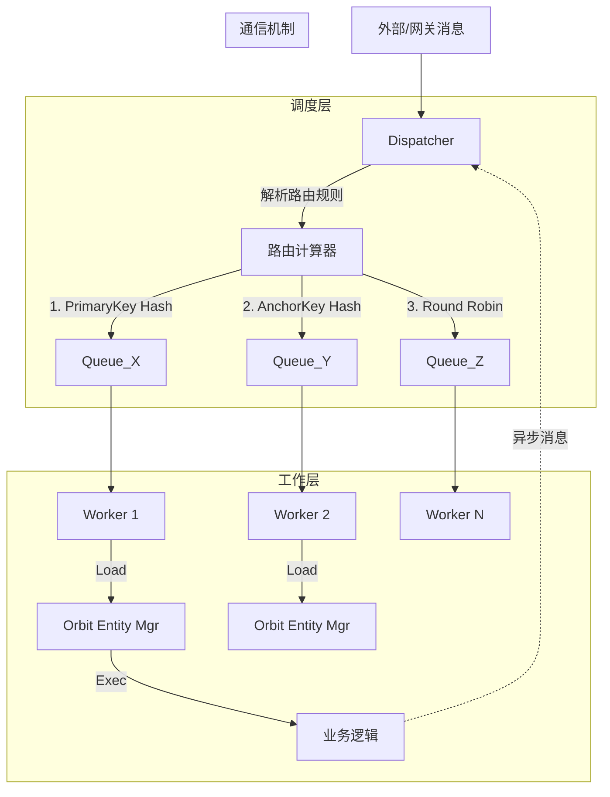

# Orbit 消息调度模型技术方案

## 1. 设计目标
本方案旨在构建一个高并发、低延迟且具备数据一致性保障的消息调度系统。系统基于 **Actor 模型** 与 **分片（Sharding）** 理念，通过确定性路由算法，在利用多核处理能力的同时，解决并发环境下的时序性与资源竞争问题。

**核心诉求：**
1.  **统一管理**：通过 `Orbit` 管理器统一接管 Entity 的生命周期。
2.  **并发执行**：启动 N 个 Consumer (Worker) 并行处理消息。
3.  **严格时序**：特定上下文下的消息必须串行处理。
4.  **异步通信**：禁止 Worker 间同步阻塞调用，强制采用异步消息转发。

## 2. 系统架构概览

系统由 **Dispatcher (调度层)**、**Worker Cluster (工作层)** 和 **Orbit Context (上下文层)** 三部分组成。

## 3. 消息路由策略 (核心算法)

调度器（Dispatcher）采用**三级优先级漏斗模型**来决定消息由哪个 Worker 处理。

### 规则一：显式主键路由 (Highest Priority)
*   **条件**：消息元数据中包含显式的 `PrimaryKey`（如订单ID、特定业务Key）。
*   **逻辑**：
    1.  提取 `PrimaryKey`。
    2.  计算 `WorkerID = Hash(PrimaryKey) % WorkerCount`。
*   **场景**：需要精准控制特定业务对象处理权的场景。

### 规则二：引用锚点路由 (Reference Anchor)
*   **条件**：无显式主键，但消息包含一个或多个 `EntityRef`（实体引用）。
*   **逻辑**：
    1.  提取所有 EntityRef 的 ID。
    2.  **排序**：对 ID 列表进行**字典序排序 (Lexicographical Sort)**，确保输入顺序无关性（即 `[A, B]` 与 `[B, A]` 等价）。
    3.  **锚点选择**：选取排序后的**第一个 ID** 作为 **AnchorKey (锚点Key)**。
    4.  计算 `WorkerID = Hash(AnchorKey) % WorkerCount`。
*   **目的**：确保涉及同一组实体（或共享同一个"最小ID"实体）的事务，始终路由到同一个 Worker，保证时序性并规避分布式锁。

### 规则三：负载均衡路由 (Fallback)
*   **条件**：既无 PrimaryKey 也无 EntityRef。
*   **逻辑**：
    1.  采用轮询 (Round-Robin) 或随机策略。
    2.  `WorkerID = AtomicAdd(Counter) % WorkerCount`。
*   **场景**：广播消息、无状态查询、系统日志等。

## 4. Worker 执行模型

Worker 是资源的持有者，而非简单的线程池。

### 4.1 处理流程
1.  **Receive**: Worker 从绑定的独占 Channel 中取出消息。
2.  **Parse**: 解析消息体，识别涉及的 `EntityRef` 列表。
3.  **Orbit Load**: 调用 `Orbit Manager` 加载 Entity。
    *   *Lazy Load*: 若内存中不存在，从 DB/Cache 加载。
    *   *Hot Cache*: 若内存中已存在，直接复用。
4.  **Execute**: 当所有 Entity 准备就绪后，注入到 Context 中，执行具体的业务逻辑。

### 4.2 异常处理
*   **隔离性**：单个 Worker 的 Panic 被捕获（Recover），不影响其他 Worker。
*   **容错**：处理失败的消息记录 Error Log，不阻塞后续消息处理。

## 5. Worker 间通信模型

为了避免死锁和级联阻塞，系统严格限制 Worker 间的交互方式。

### 5.1 禁止同步调用
*   Worker A **严禁** 直接调用 Worker B 的函数或等待 Worker B 的返回结果。
*   原因：若 A 等待 B，而 B 的队列中可能有需要 A 锁定的资源的消息，将导致环形死锁。

### 5.2 异步消息总线
*   **机制**：Worker A 若需通知 Worker B（或操作 B 管辖的 Entity），必须构造一条新的 `Message`。
*   **投递**：调用 `Context.Send(msg)`。该操作非阻塞，立即返回。
*   **回环**：消息被投递回 **Dispatcher**，重新走一遍路由逻辑（Hash -> Queue）。
*   **优势**：
    *   解耦发送者与接收者。
    *   自动符合路由规则（A 不需要知道 B 在哪个 Worker，路由算法会决定）。

## 6. 数据结构约定

### Message 接口定义规范
技术实现时，消息对象需满足以下能力：
*   `GetPrimaryKey() string`：返回路由主键。
*   `GetEntityRefs() []string`：返回涉及的实体ID列表。
*   `Payload()`：返回实际业务数据。
