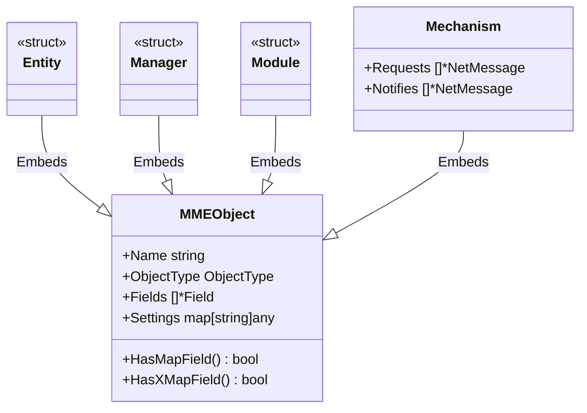

# MME Object Model (mmeobj)

`mmeobj` 是 Blueprint 代码生成工具的核心领域模型包，定义了 MME (Massive Multiplayer Engine) 架构中四大核心对象的内存表示。

该包负责承载从 YAML 蓝图文件解析出的元数据，并为代码生成器（Proto, Go Structs, Router 等）提供语义接口。

## 核心对象

所有对象均基于基类 `MMEObject` 构建：

- **Entity**: 游戏实体（如 Player, NPC），包含状态数据。
- **Manager**: 全局管理器（如 GuildManager），管理全局逻辑。
- **Module**: 功能模块（如 BagModule），挂载在 Entity 上的组件。
- **Mechanism**: 通信机制，包含 Requests 和 Notifies 定义。

## 设计模式

采用 **组合模式 (Composition)**，所有具体对象内嵌 `*MMEObject` 以复用通用属性（Name, Fields, Settings）和辅助方法。

## 功能特性

1.  **元数据封装**: 统一管理对象名称、类型、字段列表及扩展配置。
2.  **智能查询**: 提供 `HasMapField`, `HasXMapValueIsMMEObjectOrMessage` 等方法，辅助生成器判断依赖关系。
3.  **扩展性**: 通过 `Settings map[string]any` 支持 YAML 中的自定义配置透传。

